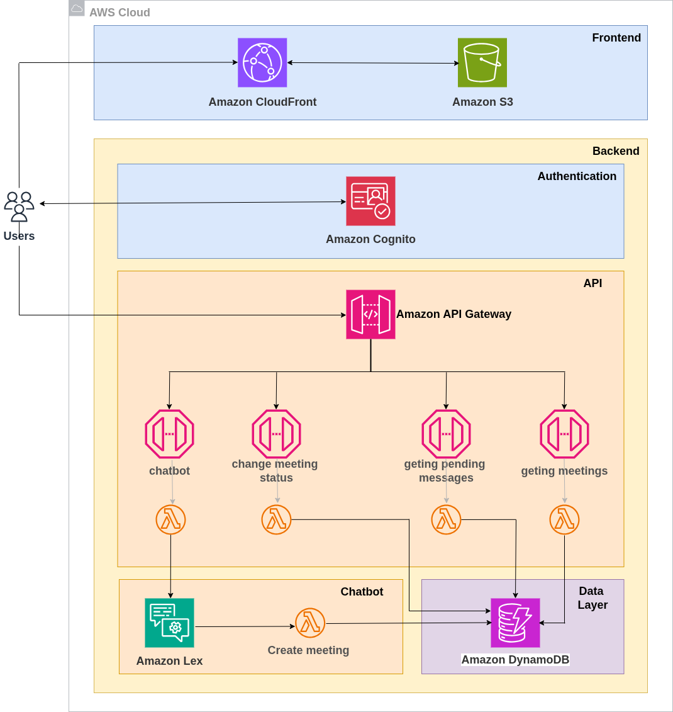
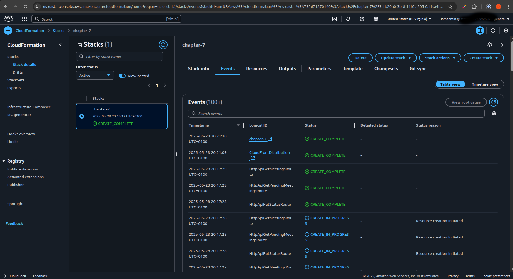
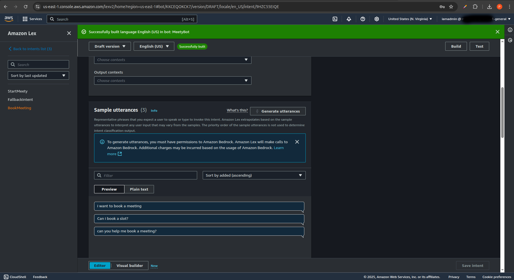
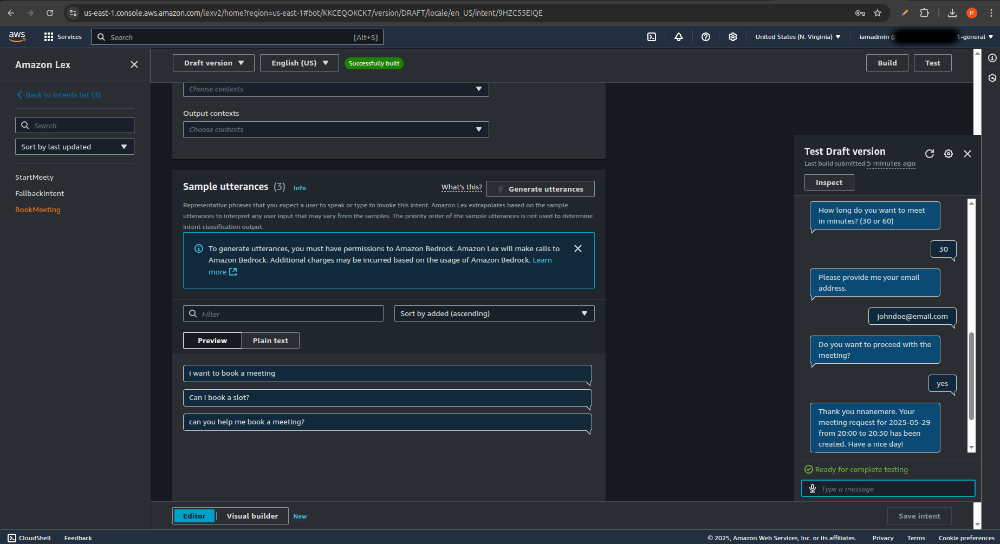
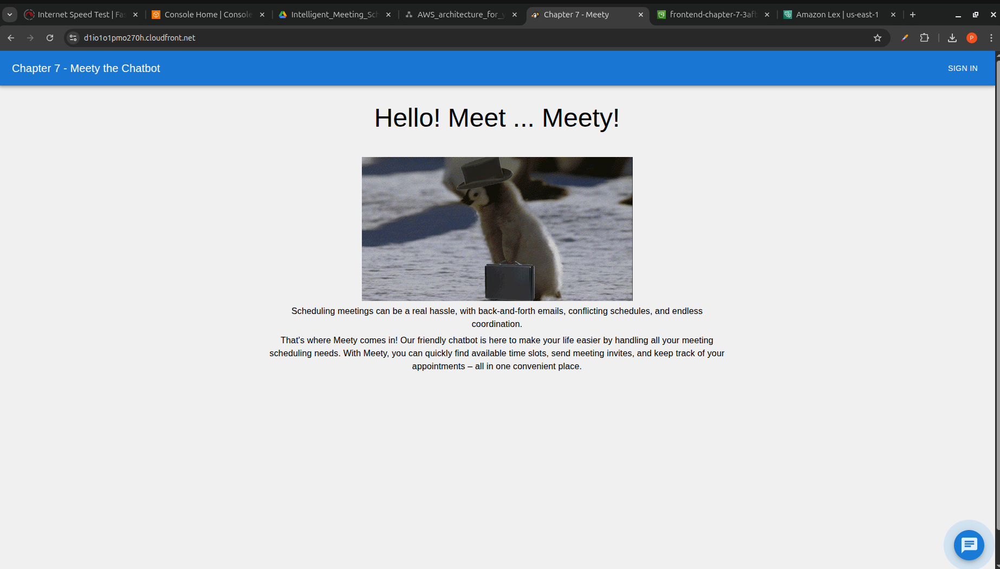
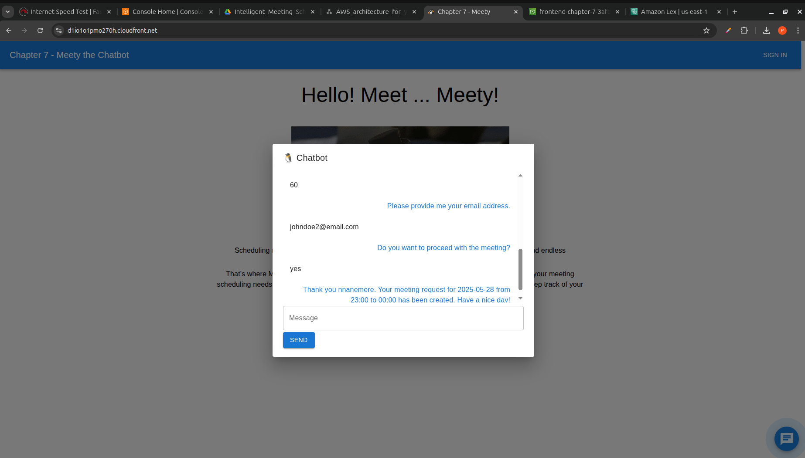
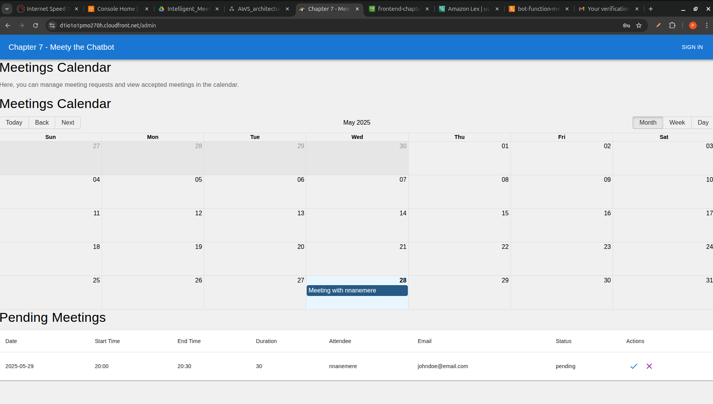

# 🤖 Intelligent Meeting Scheduler Chatbot

This project is a cloud-native chatbot application built using **Amazon Lex** to help users schedule meetings intelligently via conversational interfaces.
---

## 📑 Table of Contents

- [Overview](#-project-overview)
- [Architecture](#-cloud-architecture)
- [Technologies Used](#-technologies-used)
- [How to Deploy](#-how-to-deploy)
- [Local Development](#-local-development)
- [Improvements](#-future-improvements)
- [License](#-license)
---

## 🧩 Project Overview

This chatbot allows users to interact in natural language to:
- Schedule meetings
- Choose a date and time
- Provide an email address
- Confirm the appointment

The chatbot logic is powered by **Amazon Lex**, with frontend components built in **React + TypeScript**.
---

## Code

[Code Link](https://drive.google.com/file/d/1Y82YmurnwIcgfa0kSnzvoIhuInRb7jMr/view?usp=drive_link)
---

## ☁️ Cloud Architecture

| Component     | Technology         |
|--------------|--------------------|
| Chatbot      | Amazon Lex         |
| Hosting      | S3 + CloudFront    |
| Deployment   | CloudFormation     |
| Frontend     | React.js + Vite    |


---

## 📸 Screenshots







---

## 🛠️ Technologies Used

- Amazon Lex (Bot, Slot Types, Intents)
- Amazon CloudFront & S3 (static hosting)
- CloudFormation (Infrastructure as Code)
- React.js (frontend UI)
- TypeScript
- Vite
---

## 🚀 How to Deploy

1. **Launch the CloudFormation stack**

```bash
aws cloudformation deploy \
  --template-file platform/ch7-application-template.yaml \
  --stack-name intelligent-chatbot-stack \
  --capabilities CAPABILITY_NAMED_IAM
```

2. **Build & upload frontend to S3**

```bash
cd frontend/
npm install
npm run build
aws s3 sync dist/ s3://your-chatbot-bucket-name
```

3. **Invalidate CloudFront Cache**
```bash
aws cloudfront create-invalidation \
  --distribution-id YOUR_DISTRIBUTION_ID \
  --paths "/*"
```
---

## 🧪 Local Development

You can test and build the frontend locally.

```bash
cd frontend/
npm install
npm run dev
```
---

## 🧠 Future Improvements

- Extend the actions performed by your chatbot 
- Introduce a scheduling window
- Add multilingual support
- Maintain user profiles for different sessions
---

## 📄 License

This project is licensed under the MIT License. See the `LICENSE` file for details.
---
